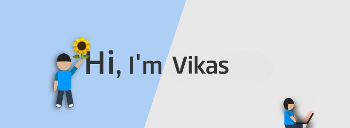

## Vikas Jonwal (he/him) 🌻

I lovee Frontend! On my GitHub, You will find Mostly Web Development projects and Machine Learning Projects. I am currently Learning Data Structures and Algorithms and JavaScript

When I'm not coding, I love to play Games.

</a> 

<h3 align="left">Connect with me:</h3>

